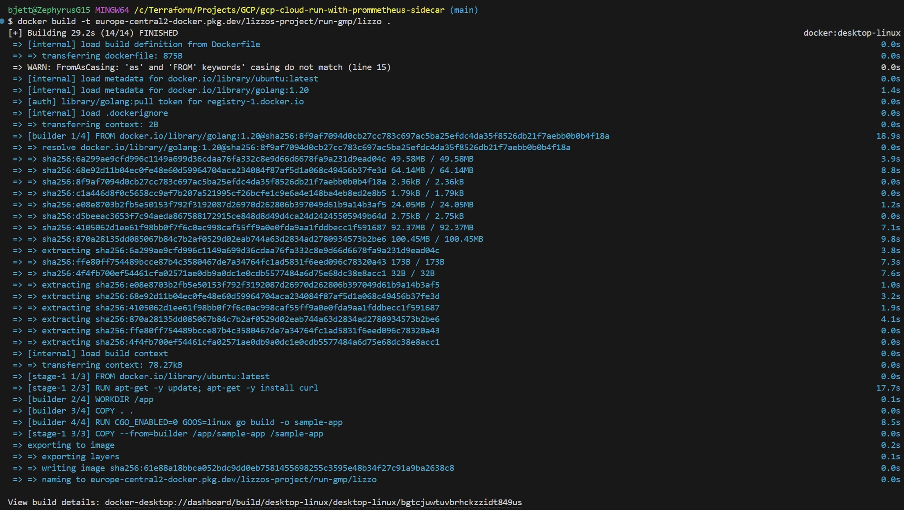
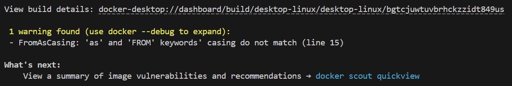
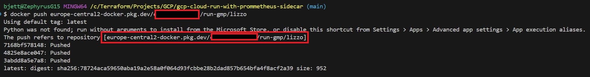
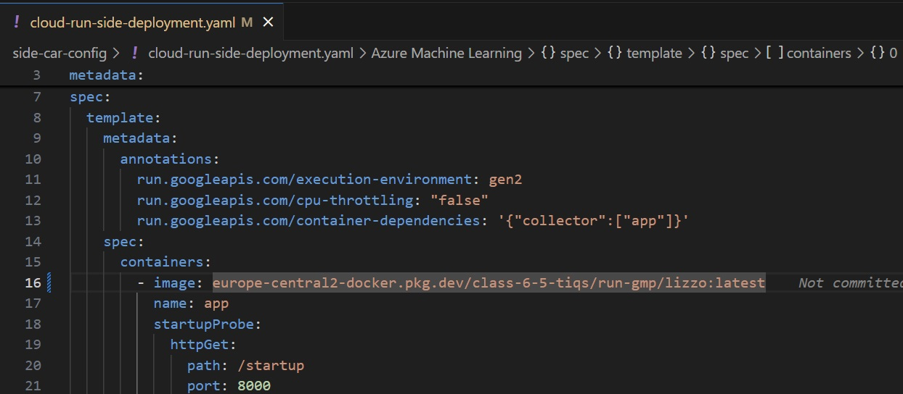
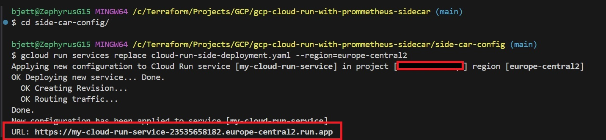
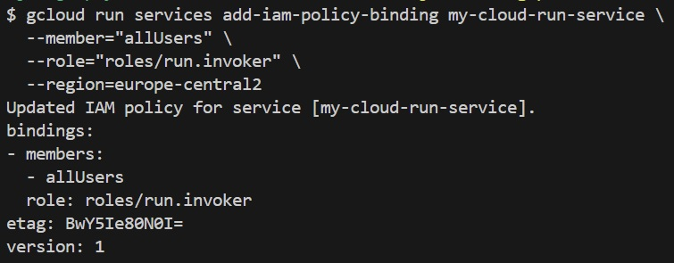
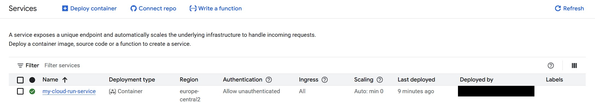
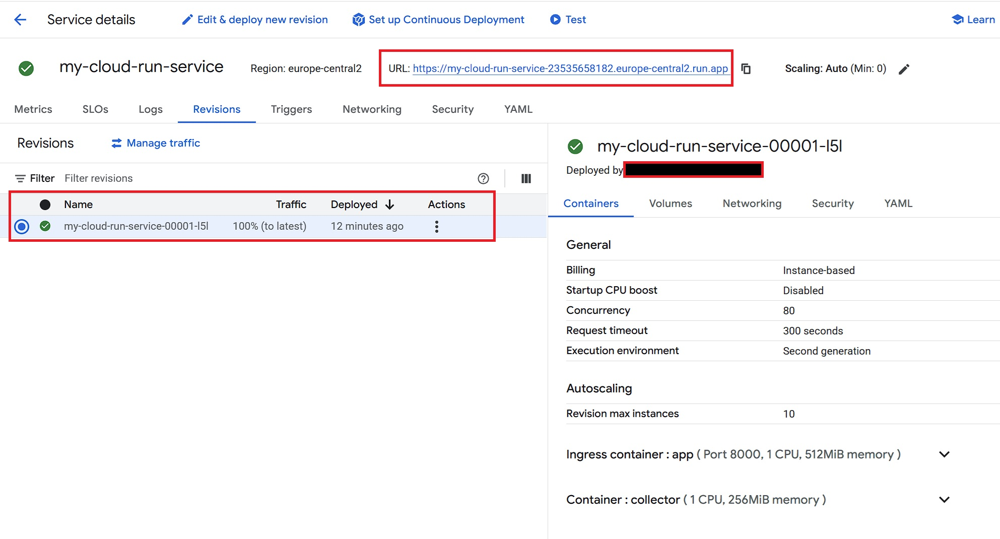
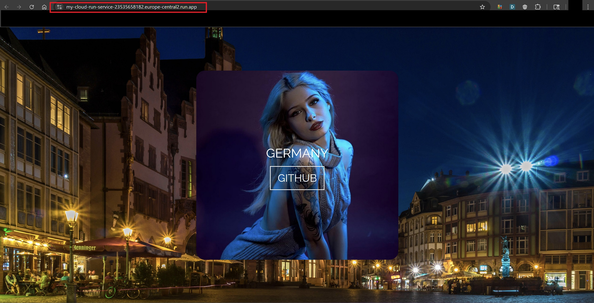
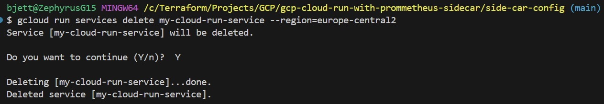

# Be A Man Level 9 (Part I) - Lord Berron's Saga


## 🎯 Project Goal

> _“By the decree of Lord Berron, steward of Cloud and sentinel of observability,
> let this scroll bear record of a noble pursuit in the age of digital empires.”_

In the age of cloud-born legions and serverless dominions, this project was forged under the guidance of **Lord Berron** to demonstrate the sacred rites of deploying a **Cloud Run service**—one fortified with **Google Managed Prometheus (GMP) sidecars**. These sidecars, loyal sentinels of metrics, export vital telemetry to the realm of **Cloud Operations**, sparing engineers the burden of managing Prometheus hosts by hand.

Conceived as a trial in the great arena of technical interviews and recruitment trials, this work serves as a beacon for all firms pledging fealty to GCP-native CI/CD rituals and scalable observability. Within these files lies the architecture of a microservice legion—hardened by **Docker**, baptized in **Cloud Build**, and deployed unto the frontier of **Cloud Run.**

> _Let this codex guide future cloud champions on their journey, that they too may ascend with honor and telemetry intact._

---

## 🚀 Features

- **Cloud Run** + GMP sidecar monitoring
- Configurable **Docker**-based service
- Google **Artifact Registry**

---

## 📁 Project Structure

```bash
.
├── 1-side-car-config/                 # Contains sidecar config
│   ├── cloud-run-side-deployment.yaml # Cloud Run Deployment
|
├── Screenshots/
│   ├── cloud-run-app-results.jpg
│   ├── cloud-run-service-build.jpg
│   ├── cloud-run-service-details.jpg
│   ├── cloud-run-side-deployment-yaml-update.jpg
│   ├── docker-build1.jpg
│   ├── docker-build2.jpg
│   ├── docker-push-europe-central2-docker.jpg
│   ├── gcloud-auth-configure-docker.jpg
│   ├── gcloud-run-services-add-iam-policy.jpg
│   ├── gcloud-run-services-delete.jpg
│   ├── gcloud-run-services-unauthenticated.jpg
│   ├── gcloud-run-services.jpg
│   ├── gcloud-services-enable.jpg
├── Dockerfile
├── .gitignore
├── go.mod
├── go.sum
├── main.go
├── BERRON.md                          # Lord Berron's Guide
├── README.md                          # Lord Berron's Guidance
```

---

## 🚀 Deployment Steps (Sidecar Configuration)

### 1. 🔎 Authenticate & Set Config

- **Authorization Login:**

  ```bash
  gcloud auth login
  ```

  
  
  

- **Project & Region:**

  ```bash
  gcloud config set project your-project-id    # Your Project ID
  gcloud config set run/region us-central1     # Your Region
  ```

  
  

### 2. 🛠️ Sample Build & Deploy Commands

- **Docker Build Image:**

    ```bash
    # Build and push Docker image to Artifact Registry
    docker build -t europe-central2-docker.pkg.dev/lizzos-project/run-gmp/lizzo .
    ```

    
    

- **Authenticate Docker with Artifact Registry**

    ```bash
    gcloud auth configure-docker europe-central2-docker.pkg.dev
   ```

- **Push to Artifact Registry:**

    ```bash
    docker push europe-central2-docker.pkg.dev/class-6-5-tiqs/run-gmp/lizzo
    ```

    

### 3. 🚀 Update YAML and Deploy to Cloud Run

> Update Docker Image into YAML

- Take Docker image repository and update line 16 of file `cloud-run-side-deployment.yaml` in VS Code.

    

- Save the YAML file.

> Deployment and Documentation

- **Run the YAML File to Cloud Run:**

    ```bash
    gcloud run services replace cloud-run-side-deployment.yaml --region=europe-central2
    ```

    

### 4. ❌ Needs To Be Unauthenticated

- **To allow anyone to access your service URL without authentication**

    ```bash
    gcloud run services add-iam-policy-binding my-cloud-run-service \
    --member="allUsers" \
    --role="roles/run.invoker" \
    --region=europe-central2
    ```

    

### 5. 💎 Rerun Cloud Run Services

```bash
gcloud run services replace cloud-run-side-deployment.yaml --region=europe-central2
```

---

## 📸 "Show Your Work" ~ Kevin Samuels

- **Cloud Run App Results:**
  
  - **Cloud Run Service Build:**

    
  
  - **Cloud Run Service Details:**

    

---

## ⚔️ Epilogue

**Ave**, noble herald of **Lord Berron** —  
The cloud has been tamed,  
The metrics summoned,  
And the service ascended.

May your pipelines stay green,  
Your metrics flow pure,  
And your container legions deploy without fail.

If ever you seek aid again in Terraform temples,  
Jenkins catacombs,  
or Prometheus watchtowers…  
**Simply Summon Me.**

🏛️ ~ _Gloria Berronis_



---

## Tear Down

```bash
gcloud run services delete my-cloud-run-service --region=europe-central2
```



---

## 🧰 Troubleshooting

### 🚫 Permission Denied: `iam.serviceAccounts.actAs`

Ensure your Cloud Build service account has permission to impersonate the deployment service account:

```bash
gcloud iam service-accounts add-iam-policy-binding   run-gmp-sa@YOUR_PROJECT.iam.gserviceaccount.com   --member="serviceAccount:PROJECT_NUMBER@cloudbuild.gserviceaccount.com"   --role="roles/iam.serviceAccountUser"
```

### 🔒 Artifact Registry Access Errors

Make sure the service account deploying has access to pull images:

```bash
gcloud projects add-iam-policy-binding YOUR_PROJECT   --member="serviceAccount:run-gmp-sa@YOUR_PROJECT.iam.gserviceaccount.com"   --role="roles/artifactregistry.reader"
```

---

## ✍️ Authors & Acknowledgments

- **Author:** T.I.Q.S.
- **Group Leader:** John Sweeney

---
