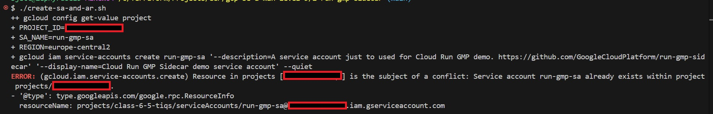

# 🚀 Be A Man Level 9 (Part II) - Cloud Build Saga


> Cloud Run deployment with metrics exposed via Prometheus client and scraped by Google Managed Service for Prometheus (GMP). Includes image publishing to Artifact Registry and service deployment via GCP CLI.

---

## 📖 References

- [Official GMP Sidecar Docs](https://cloud.google.com/stackdriver/docs/managed-prometheus/cloudrun-sidecar)
- [Cloud Run + Prometheus with OpenTelemetry](https://cloud.google.com/stackdriver/docs/solutions/metrics-ingestion)
- [The Full Cloud Build Logs from the GCP CI Pipeline](/Screenshots/cloud-build-logs.mp4)

---

## 📁 Project Structure

```bash
GCP-BE-A-MAN-LEVEL-9/
.
│
├── 2-run-gmp-sidecar/               # App + Prometheus
│ ├── collector/                     # Prom collector examples
│ ├── confgenerator/                 # Config generation logic
│ ├── integration_test/              # Integration tests
│ ├── sample-apps/                   # Example apps with metrics
│ ├── .dockerignore
│ ├── .gitignore
│ ├── clean-up-cloud-run.sh          # GCP resource cleanup sh
│ ├── cloudbuild-simple.yaml         # Small Cloud Build config
│ ├── cloudbuild-single-req.yaml     # Cloud Build Single Req
│ ├── cloudbuild.yaml                # Multi-step Cloud Build
│ ├── CONTRIBUTING.md
│ ├── create-sa-and-ar.sh            # SA  and Artifact Registry
│ ├── default-config.yaml            # Default Prometheus config
│ ├── Dockerfile                     # Dockerfile for Cloud Run
│ ├── entrypoint.go                  # Entry with Prom metrics
│ ├── go.mod
│ ├── go.sum
│ ├── LICENSE
│ ├── Makefile
│ ├── policy.yaml                    # GMP and RBAC policy
│ ├── README.md
│ ├── run-service-simple.yaml        # Basic Cloud Run
│ └── run-service.yaml               # Full Cloud Run
│
├── Screenshots/
│   ├── create-sa-and-ar-sh.jpg
│   ├── gcloud-artifacts-repositories-create-run-gmp1.jpg
│   ├── gcloud-artifacts-repositories-create-run-gmp2.jpg
│   ├── gcloud-auth-configure-docker.jpg
│   ├── gcloud-auth-login1.jpg
│   ├── gcloud-auth-login2.jpg
│   ├── gcloud-auth-login3.jpg
│   ├── gcloud-config-set-project.jpg
│   ├── gcloud-config-set-run-region.jpg
│   ├── gcloud-projects-add-iam-policy-section1.jpg
│   ├── gcloud-projects-add-iam-policy-section2.jpg
│   ├── my-cloud-run-build-results.jpg
│   ├── my-cloud-run-gcloud-build-submit.jpg
│   ├── my-cloud-run-service-details.jpg
│   └── my-cloud-run-url-confirmation.jpg
│
├── .gitignore
├── BUILD.md                         # Cloud Build instructions
```

---

## 🚀 Deployment Steps (Run-GMP-Sidecar Deployment)

### 1. Authenticate & Set Config

- **Authorization Login:**

  ```bash
  gcloud auth login
  ```

  
  
  

- **Project & Region:**

  ```bash
  gcloud config set project your-project-id    # Your Project ID
  gcloud config set run/region us-central1     # Your Region
  ```

  
  

### 2. Enable Required APIs

```bash
gcloud services enable run.googleapis.com \  # Cloud Run
    artifactregistry.googleapis.com \        # Artifact Registry
    secretmanager.googleapis.com \           # Secret Manager
    monitoring.googleapis.com \              # Cloud Monitoring
    logging.googleapis.com \                 # Cloud Logging
    cloudbuild.googleapis.com \              # Cloud Build
    iam.googleapis.com                       # IAM
```


### 3. Create Docker Repository

```bash
gcloud artifacts repositories create run-gmp \
  --repository-format=docker \
  --location=us-central1 \
  --description="Run GMP Docker Repo for Cloud Run"
```


### 4. Configure Permissions

- **Run Create SA Shell Script:**

  ```bash
  ./create-sa-and-ar.sh
  ```

  

### (OR)

- **Create Service Account:**

  ```bash
  gcloud iam service-accounts create run-gmp-sa \
    --display-name="Cloud Run GMP SA"
  ```

- **NOTE:** If the Shell Script does not work add these IAM policies manually.

  ```bash
  gcloud projects add-iam-policy-binding class-6-5-tiqs \
    --member="user:daquietstorm22@gmail.com" \
    --role="roles/artifactregistry.writer"

  gcloud projects add-iam-policy-binding class-6-5-tiqs \
    --member="serviceAccount:run-gmp-sa@class-6-5-tiqs.iam.gserviceaccount.com" \
    --role="roles/artifactregistry.writer"

  gcloud projects add-iam-policy-binding class-6-5-tiqs \
    --member="serviceAccount:run-gmp-sa@class-6-5-tiqs.iam.gserviceaccount.com" \
    --role="roles/storage.objectViewer"

  gcloud projects add-iam-policy-binding class-6-5-tiqs \
    --member="serviceAccount:run-gmp-sa@class-6-5-tiqs.iam.gserviceaccount.com" \
    --role="roles/cloudbuild.builds.editor"

  gcloud projects add-iam-policy-binding class-6-5-tiqs \
    --member="serviceAccount:run-gmp-sa@class-6-5-tiqs.iam.gserviceaccount.com" \
    --role="roles/logging.logWriter"

  gcloud projects add-iam-policy-binding class-6-5-tiqs \
    --member="serviceAccount:run-gmp-sa@class-6-5-tiqs.iam.gserviceaccount.com" \
    --role="roles/run.admin"

  gcloud iam service-accounts add-iam-policy-binding \
    run-gmp-sa@class-6-5-tiqs.iam.gserviceaccount.com \
    --member="serviceAccount:23535658182@cloudbuild.gserviceaccount.com" \
    --role="roles/iam.serviceAccountUser"
  ```

    
    

### 5. Configure Docker Auth

```bash
gcloud auth configure-docker us-central1-docker.pkg.dev
```


### 6. Build, Push Container, and Deploy to Cloud Run

```bash
cd 2-run-gmp-sidecar/

gcloud builds submit . \
  --config=cloudbuild-simple.yaml \
  --region=us-central1
```


### 7. Unauthentication (if Cloud Build Errors out at Step 4)

```bash
gcloud run deploy my-cloud-run-service \
  --image=us-central1-docker.pkg.dev/class-6-5-tiqs/run-gmp/sample-app \
  --region=us-central1 \
  --platform=managed \
  --allow-unauthenticated \
  --service-account=run-gmp-sa@class-6-5-tiqs.iam.gserviceaccount.com
```

---

## 📸 "Show Your Work" ~ Kevin Samuels

- **Cloud Build Results:**

  

- **Cloud Run Service Details:**

  

- **Cloud Run URL Confirmation:**

  

- **Prometheus Metrics Results:**

  

---

## 🛠️ Troubleshooting

### 🔴 Image Push Errors

Ensure IAM roles for Artifact Registry are correctly bound:

```bash
roles/artifactregistry.writer
```

### 🔴 Cloud Run Deployment Fails

> Check that the service account exists and has permissions:

  ```bash
  gcloud iam service-accounts list
  ```

### 🔴 Prometheus Metrics Not Appearing

- Make sure `/metrics` endpoint is exposed.
- Ensure Monitoring API is enabled.
- GMP autodiscovery may require manual annotations in YAML if using a GitOps approach.

---

## ✅ Completion Checklist

- ✅ Authenticated with `gcloud`
- ✅ Enabled all required APIs
- ✅ Created and configured Artifact Registry
- ✅ Built and pushed Docker image
- ✅ Verified IAM policy bindings
- ✅ Deployed service to Cloud Run
- ✅ Validated metrics at `/metrics`
- ✅ Captured proof screenshots

---

## ✍️ Authors & Acknowledgments

- **Author:** T.I.Q.S.
- **Group Leader:** John Sweeney

---
